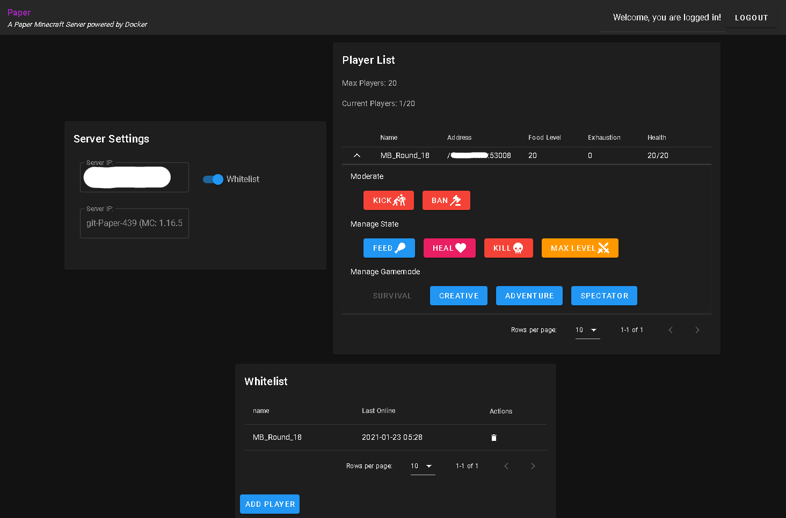

# mc-graphql-admin





> Before deploying this web interface, make sure you have a release version or the latest snapshot!

## Plugin Download

### Setup

[mbround18/mc-doubletap](https://github.com/mbround18/mc-doubletap)

### Snapshot

> Download snapshot button still under development
1. ](https://github.com/mbround18/mc-doubletap/blob/main/docs/assets/download-snapshot.png?raw=true)
2. [Follow install instructions](https://github.com/mbround18/mc-doubletap/blob/main/README.md)

## Deployment Options

### Heroku

[](https://heroku.com/deploy)

### Netlify
<a href="https://app.netlify.com/start/deploy?repository=https://github.com/mbround18/mc-doubletap-panel">
  
</a>


### Self-hosted

1. Clone the repo
2. `yarn install`
3. Modify a file in your project root called `.env` containing the following:
   | Variable   | Description |
   | --------------------- | ------------------------------------------------------------------------------------------------------------- |
   | DOMAIN_NAME           | The domain in which you intend to run this app from.                                                          |
   | ENDPOINT_URL          | The host of your minecraft server, something like https://mc.boop.ninja                                       |
   | DISCORD_CLIENT_ID     | Client ID of your discord app for authorization. Check out: https://discord.com/developers/applications       |
   | DISCORD_CLIENT_SECRET | Client Secret of your discord app for authorization. Check out: https://discord.com/developers/applications   |
   | DISCORD_CODE_VERIFIER | Random string thats up to you! This is a secret in which your app and discord share. Make it unique!          |
4. Run yarn generate
5. Copy files in your dist folder to your web hosting directory.

## Build Setup

```bash
# install dependencies
$ yarn install

# serve with hot reload at localhost:3000
$ yarn dev

# build for production and launch server
$ yarn build
$ yarn start

# generate static project
$ yarn generate
```

For detailed explanation on how things work, check out [Nuxt.js docs](https://nuxtjs.org).
